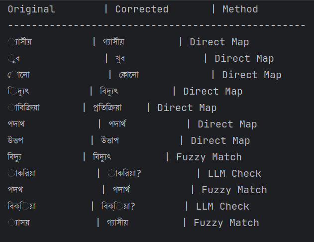

# Bengali OCR Reconstruction Tool

## Project Overview
This project is a Python-based text processing tool designed to reconstruct corrupted Bengali words resulting from OCR (Optical Character Recognition) errors. It employs a multi-tiered correction pipeline, evolving from simple mapping to advanced fuzzy logic and AI-based prediction prototypes.

## Output Sample:


## Development Methodology: Agile & Iterative
This project was built using an **Agile implementation model**, ensuring a deployable and functional product at the end of every iteration (Sprint). Each sprint introduced specific features while maintaining backward compatibility.

### Git Branching Strategy
The repository is structured into three distinct branches, representing the project's evolution. Each branch serves as a standalone, functional version of the software:

* **`sprint-1` (MVP - Basic Approach):**
    * **Feature:** Implemented the `BengaliCorrector` class with O(1) direct dictionary mapping.
    * **Status:** Functional. Solves specific, hardcoded error patterns found in `dictionary.json`.
* **`sprint-2` (Logic Enhancement - Advanced):**
    * **Feature:** Integrated `difflib` for Fuzzy Matching.
    * **Data Structure:** Refactored `dictionary.json` to separate `direct_mappings` from `valid_vocabulary`.
    * **Status:** Functional. Can correct unseen typos by calculating Levenshtein distance.
* **`sprint-3` (Scalability - Final Version):**
    * **Feature:** Added an architecture for **LLM (Large Language Model)** integration.
    * **Logic:** Implemented a fallback mechanism (`_predict_with_llm`) to handle edge cases that fail both dictionary and fuzzy checks.
    * **Status:** Production-ready prototype.

> **Note:** Because each step was treated as a release, you can checkout `sprint-2` to run the tool without the LLM architecture overhead, ensuring a clean rollback if needed.

## Technical Architecture

### Object-Oriented Design
The core logic is encapsulated within the `BengaliCorrector` class in `src/corrector.py`. This design allows for modular data loading and easy extension of correction algorithms without modifying the main execution flow.

### Correction Pipeline
The system processes words through a prioritized pipeline:

1.  **Direct Mapping (O(1)):** Checks a hash map for known, frequent OCR errors (e.g., 'পদাথ' → 'পদার্থ').
2.  **Vocabulary Validation (O(1)):** Verifies if the word is already a valid Bengali word.
3.  **Fuzzy Matching (Levenshtein Distance):** If the word is unknown, it calculates similarity against the vocabulary using Python's standard `difflib`.
4.  **LLM Fallback (Prototype):** For words that are statistically distinct from the vocabulary, the system routes them to a mock API method, designed to interface with models like **Google Gemini** or **OpenAI** in a production environment.

## Project Structure
```text
.
├── data/
│   ├── corrupted_words.txt    # Input Data
│   ├── corrected_words.txt    # Generated Output
│   └── dictionary.json        # Knowledge Base (Mappings + Vocabulary)
├── src/
│   ├── main.py                # Application Entry Point (File I/O)
│   └── corrector.py           # Core Logic Class
├── img.png                    # Output Preview
└── README.md                  # Documentation
```

## Challenges & Considerations
* **Context Ambiguity:** Words like "বিক্রিয়া" (Reaction) vs "প্রতিক্রিয়া" (Response) are syntactically similar. Without sentence-level context (NLP), simple mapping assumes the most likely correction based on domain.
* **Encoding:** Strict UTF-8 encoding was enforced to handle Bengali Unicode characters correctly.
* **Scalability:** While `difflib` works for this assessment, for a large corpus, I would switch to `rapidfuzz` or a prefix-tree (Trie) to reduce complexity from O(N*M) to O(L).

## Usage

### Prerequisites
* **Python 3.12+ (I used 3.14 here)**
* **uv** (Recommended for dependency management and environment isolation)

### Option 1: Using `uv` (Recommended)
This project is configured with `uv` for reproducible execution. This method automatically handles the virtual environment and python versioning defined in `pyproject.toml`.

1.  **Sync Environment:**
    Ensure the environment is synchronized with the lockfile.
    ```bash
    uv sync
    ```

2.  **Run the Corrector:**
    Execute the main script within the managed environment.
    ```bash
    uv run src/main.py
    ```

### Option 2: Standard Python
If you are running this in an environment without `uv`:

1.  **Manual Setup:**
    ```bash
    # Create and activate virtual environment
    python3 -m venv venv
    source venv/bin/activate  # Windows: venv\Scripts\activate
    ```

2.  **Execution:**
    ```bash
    python src/main.py
    ```

### Output
* **Console:** Displays a formatted table of Original vs. Corrected words and the method used (Direct Map, Fuzzy, or LLM).
* **File:** Corrected words are saved to `data/corrected_words.txt`.